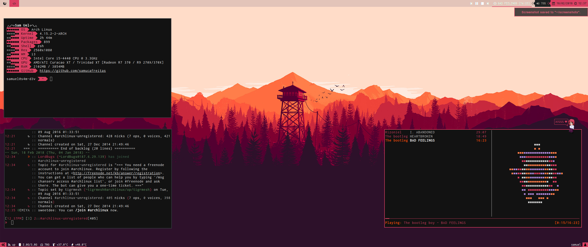

# dotfiles



+ wm: i3
+ shell: zsh
+ font: Inconsolata
+ bar: lemonbar
+ terminal: urxvt

# Installation
```shell
bash <(curl -s -L https://bitbucket.org/samucafreitas/dotfiles/raw/master/setup.sh)
```
